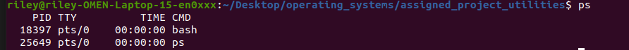
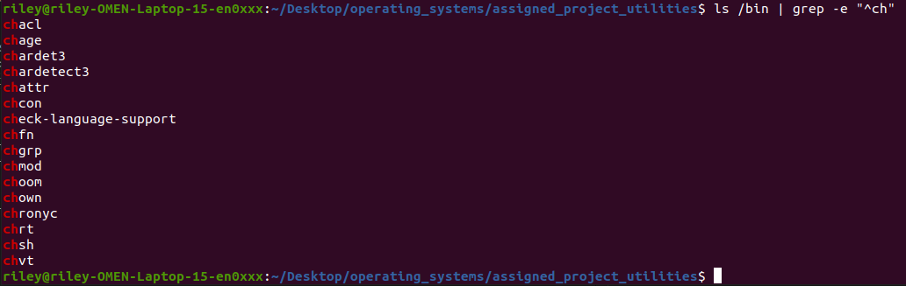

Questions:

1. The root directory "/" is where all files on the OS live and can be accessed. the command `cd /` takes you to the root directory

2. `touch foo.txt` creates an empty file in the current directory.

3. `mv foo.txt bar.txt` renames the file. 

4. `whereis ls` gives you the location of the ls cmd. Its output is "ls: /usr/bin/ls /usr/share/man/man1/ls.1.gz"

5. `whoami` prints the current user. Its output was "riley"

6. Environment variables are variables that are managed by the OS and are acessible to scripts and executables running in the shell (environment). They are often passed to syscalls or used when determining behavior of spawned processes. `printenv` prints the current environment variables

7. `echo $SHELL` gives the name of the shell. Its output is "/bin/bash". The shells process ID can be found by running ps. Its output is 

8. `uname -v`gives you the kernel version. Its output is "#137~20.04.1-Ubuntu SMP Fri Nov 15 14:46:54 UTC 2024"

9. This can be done by piping the output of the ls cmd into a grep with the string "ch" -> `ls /bin | grep -e "^ch"`. The output of running this command is 

10. Similar to q9, We can get the output of ls with the home directory and the flag -A (to show everything but the . and .. output) to get all files and directories. We can get the count via the flags -c and ignore the directories with -v. The command ran was `ls -A -p ~ | grep -c -v '/$'`, and its output was 16.

11. `grep -r "int i" --include="*.c" .` searches recursively for any file ending in ".c" for the pattern "int i".  